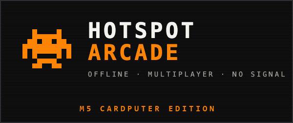
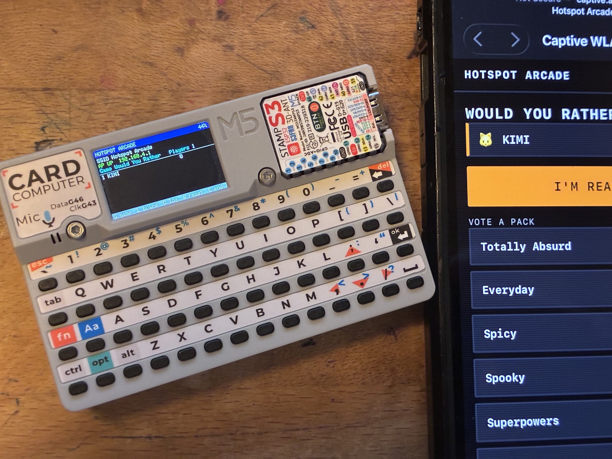
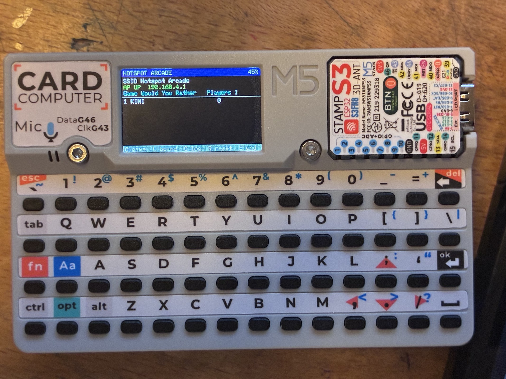
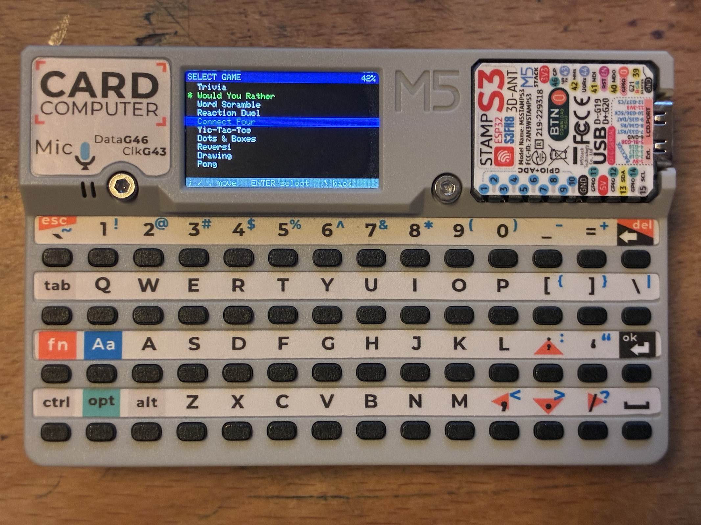

<p align="center">
  
</p>

# Hotspot Arcade — M5Stack Cardputer

[](https://github.com/genkigenki/hotspot-arcade-cardputer/actions/workflows/build.yml)
[](https://github.com/genkigenki/hotspot-arcade-cardputer/releases/latest)
[](LICENSE)

Ten party games your guests play from their phones. The Cardputer opens a WiFi
access point and a captive portal, everyone joins and plays in the browser — no app
to install — and the Cardputer's own screen is the host: lobby, game picker,
scoreboard, event log.

<p align="center">
  
</p>

This is a **host port** of [tarikbc/hotspot-arcade](https://github.com/tarikbc/hotspot-arcade),
which runs the same games as a Flipper Zero app driving a separate ESP32 board over
UART. Here the whole thing collapses onto one device. The game engine, the phone
client and the content packs are upstream's, used unmodified. What is new here is the
host: the on-device UI, the state mirror it draws from, and the pipeline that bakes
the assets into flash.

If you have a Flipper, use upstream — it is the original and it is excellent. This
repo is for people who have a Cardputer and no Flipper.

## Install

Two routes, and the difference matters.

**Keep M5Launcher** (recommended). The Cardputer's stock M5Launcher layout puts
loaded apps in `ota_0` at `0x170000` and keeps the launcher itself in the test
partition. Writing only the app image leaves the launcher untouched — you still get
back into it the usual way, by holding the button at boot.

```bash
esptool --chip esp32s3 --port COM7 --baud 921600 write_flash 0x170000 hotspot-arcade-cardputer.ino.bin
```

Whatever app was in `ota_0` gets replaced. You can also drop the same `.bin` on the
microSD and launch it from the launcher — same slot, same result, no PC.

**Full install** (replaces everything, launcher included — recovery is M5Burner):

```bash
esptool --chip esp32s3 --port COM7 --baud 921600 write_flash 0x0 hotspot-arcade-cardputer.full.bin
```

Replace `COM7` with your port (`/dev/ttyACM0`, `/dev/cu.usbmodem*`). `esptool` comes
with the esp32 core, or `pip install esptool`. If the board does not enter download
mode by itself, hold **G0** on the StampS3 while plugging in USB-C.

Both images are on the [releases page](../../releases). The repo is also laid out for
M5Burner (`m5burner.json` + `firmware/`); see [Distribution](#distribution).

## Hardware

Cardputer **v1** (StampS3: ESP32-S3FN8, 8MB flash, no PSRAM). Firmware is ~1.2MB of
a 3.3MB app slot and ~78KB of static RAM, leaving ~250KB free at runtime.

Not tested on the Cardputer ADV. It should build, but the ADV has a different
keyboard controller (TCA8418) and antenna, so treat it as unverified.

Two practical limits, both inherited from the hardware: the v1's antenna is its known
weak spot — eight phones in a room is fine, range is worse than a dev board with an
external antenna — and the 120mAh internal cell will not carry an access point plus
backlight for a party. Use the 1400mAh base or stay on USB.

## Using it

The AP comes up at boot; there is no start step. Phones join **Hotspot Arcade** (open)
and land on `http://192.168.4.1`.

<p align="center">
  
</p>

The dashboard is the host view: SSID and IP, whether the AP is up, the active game,
the live scoreboard, and the last event. Everything else is one key away.

| key | |
| --- | --- |
| `G` | select game (arrow keys move, `Enter` picks, `Esc` backs out) |
| `L` | full leaderboard |
| `C` | event log |
| `R` | reset scores |
| `E` | end the current round |
| `N` | rename the AP (restarts it, which drops every phone) |
| `P` | stop / start the AP |
| `Esc` | back to the dashboard |

Serial at 115200 prints the AP address, asset counts and free heap at boot.

Games: trivia, would-you-rather, word scramble, reaction duel, connect four,
tic-tac-toe, dots & boxes, reversi, drawing, pong. All of them are phone-driven; the
host picks which one is live and watches.

<p align="center">
  
</p>

## Build

Needs `node` and `arduino-cli`.

```bash
tools/build.sh --deps
```

`--deps` installs esp32 core 3.3.11 and the M5Cardputer library (which pulls
M5Unified and M5GFX); drop it after the first run. The FQBN matters:

```
esp32:esp32:m5stack_cardputer:FlashSize=8M,PartitionScheme=default_8MB
```

The board's *default* partition scheme is the 4MB one with a 1.2MB app slot, which
this firmware does not fit in.

## How it relates to upstream

| | upstream (Flipper + ESP board) | here |
| --- | --- | --- |
| game engine | `esp32/hotspot-arcade-fw/ha_games.h` | the same file, unmodified |
| phone client | streamed over UART at session start | baked into flash |
| content packs | read off the Flipper's SD, streamed | baked into flash |
| host reports | UART v2 frames (`docs/PROTOCOL.md`) | the same six sinks, called in-process |
| host UI | Flipper scenes, 128×64 mono | `ha_ui.h`, 240×135 colour + keyboard |

The engine reaches its host through six sink functions. Upstream implements them by
framing UART bytes; this port implements them as direct calls into a local mirror.
That is the whole trick — the protocol is unchanged in shape, only its transport is
gone, and `docs/PROTOCOL.md` upstream still describes what flows.

New code lives in four files under `hotspot-arcade-cardputer/`:

| | |
| --- | --- |
| `hotspot-arcade-cardputer.ino` | AP, captive portal, WebSocket, the six sinks |
| `ha_ui.h` | five screens + keyboard |
| `ha_host.h` | roster / score / event mirror |
| `ha_content.h` | baked-pack parser (a port of upstream's `content_stream_pack()`) |

## Staying in sync

**The rule: nothing under `vendor/` is ever edited here.** Everything in it is
upstream's, copied verbatim, with the exact commit pinned in [UPSTREAM.md](UPSTREAM.md).
Want a game changed? Change it upstream — then both projects get it.

```bash
node tools/sync-upstream.mjs ../hotspot-arcade   # refresh vendor/ + re-pin the commit
node tools/gen-assets.mjs                        # re-bake into the sketch
```

`git diff vendor/` after a sync is exactly the upstream change. `gen-assets.mjs`
copies the three engine headers into the sketch folder because arduino-cli builds
from a copy of the sketch directory, so an include reaching outside it would not
resolve — those copies are generated and carry a banner saying so.

## Distribution

- **Releases** — the app image and the full image, on every tag.
- **M5Burner** — `m5burner.json` and `tools/package-m5burner.sh` produce the layout
  [m5stack/M5Stack-Firmware](https://github.com/m5stack/M5Stack-Firmware) wants
  (`firmware/cardputer/<name>_<address>.bin`). Getting listed means forking that
  repo, adding this repo's URL to `firmware-repo.list`, and opening a PR; after
  that, M5Burner picks up new releases on its own. Note this is the **full** install.
- **M5Launcher / LauncherHub** has no documented submission process — it is a word
  with the maintainer, not a PR.

## Status

Runs on real hardware: AP, captive portal, phones playing, host UI and keyboard all
confirmed on a Cardputer v1. The content-pack parser is additionally checked
off-target against the real engine (trivia topics, options and answer index; a
drawing round pulling a word from a pack).

Unverified: the Cardputer ADV, and long sessions with a full eight phones.

## License

MIT — see [LICENSE](LICENSE), same as upstream. `vendor/libs/` holds third-party
libraries under their own licenses.
